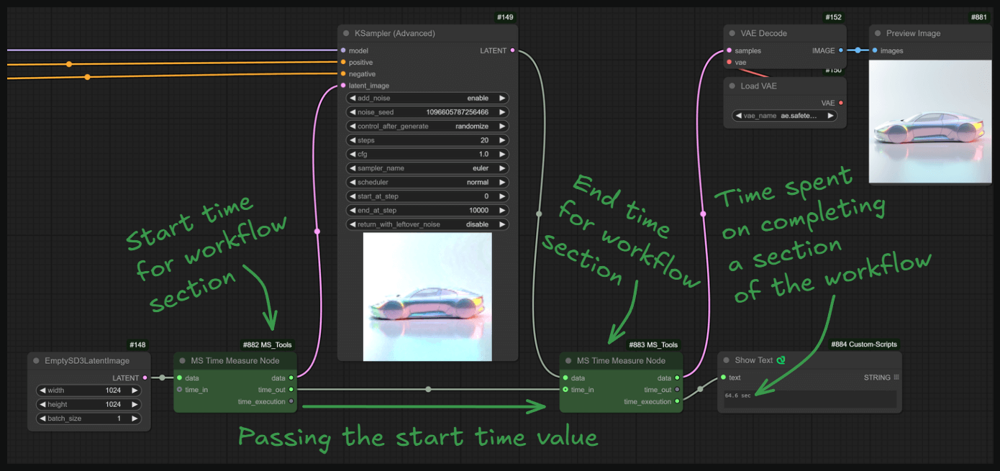
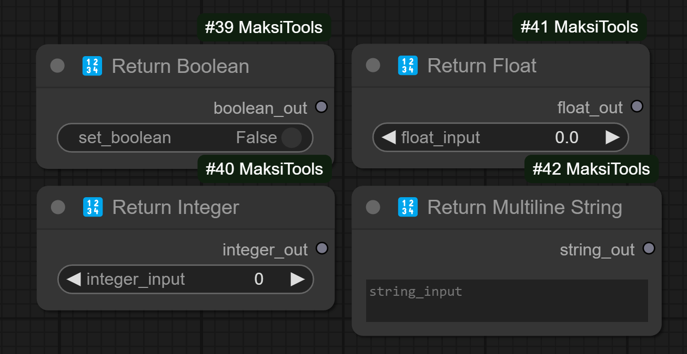

# ComfyUI-MaksiTools
This is an evolving set of tools for testing the workflows in ComfyUI.

## List of nodes:
### 1. Debugging 
#### 1.1 MT Time Measure Node
> This node is designed to measure time on a specific section of the workflow for testing and statistics collection.
> 
> 

### 2. DataTypes
> These nodes are needed to apply basic data types.
> 
> 
